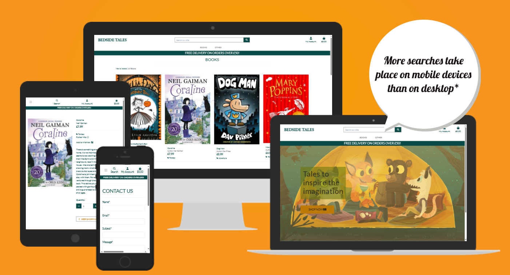
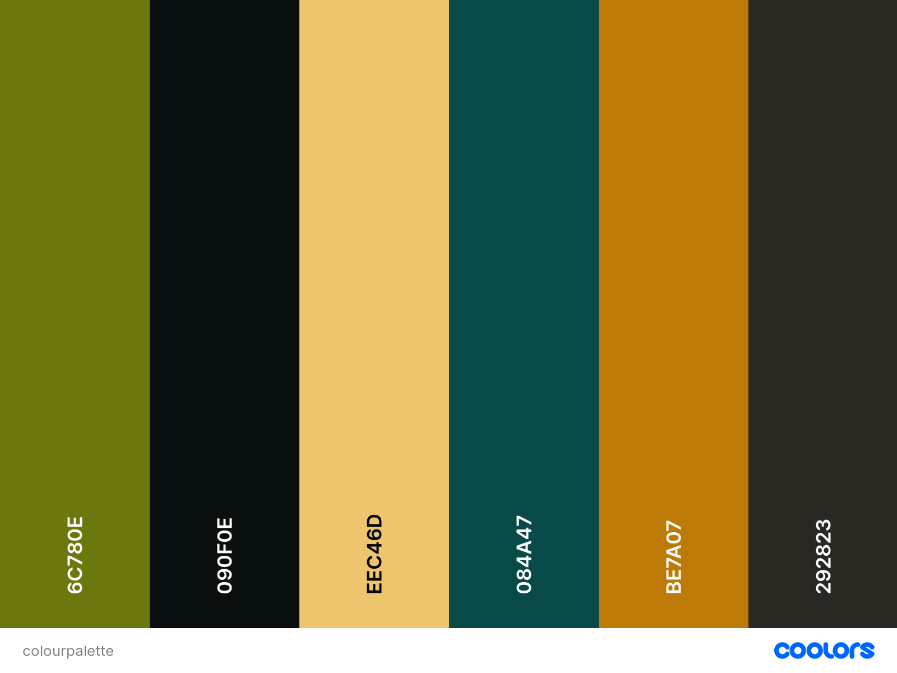

# Bedside Tales

Bedside Tales is an online children's book shop developed using Bootstrap, Django, Python, HTML, CSS and JavaScript.

Bedside Tales is a business to customer e-commerce site (B2C). It is designed for those who wish to find appropriate, inspiring bed time reading for children.

The site is deployed to Heroku, uses Amazon S3 for cloud storage, ElephantSQL for the database and Stripe for payment processing.

[Go to Bedside Tales!](https://project-5-bedside-tales-0c52d874d839.herokuapp.com/)

* [User Experience (UX)](#User-Experience-(UX))
  * [User & Blog Goals](#User-&-Blog-Goals)
  * [Agile Methodology](#Agile-Methodology)
  * [Epics & User Stories](#Epics-&-User-Stories)

* [Design](#Design)
  * [Colour Scheme](#Colour-Scheme)
  * [Fonts](#Fonts)
  * [Imagery](#Imagery)
  * [Wireframes](#Wireframes)
  * [Database Model](#Database-Model)

* [Features & Feature Testing](#Features)
  * [Future features](#Future-features)

* [Security Features & Defensive Design](#Security-Features-&-Defensive-Design)

* [Technologies Used](#Technologies-Used)
  * [Languages Used](#Languages-Used)
  * [Django](#Django)
  * [Frameworks, Libraries & Programs Used](#Frameworks,-Libraries-&-Programs-Used)

* [Testing](#Testing)

* [Deployment](#Deployment)
  * [Create the live database which can be accessed by Heroku](#create-the-live-database-which-can-be-accessed-by-heroku)
  * [Heroku app setup:](#heroku-app-setup)
  * [Prepare env.py and settings.py files](#prepare-envpy-and-settingspy-files)
  * [Create files / directories](#create-files--directories)
  * [Update Heroku Config Vars](#update-heroku-config-vars)
  * [Deploy](#deploy)
  * [Local Deployment](#Local-Deployment)
  * [Remote Deployment](#Remote-Deployment)
  * [Deploy project to Heroku](#Deploy-project-to-Heroku)
  
* [Credits](#Credits)
  * [Code](#Code)
  * [Acknowledgements](#Acknowledgements)

## User Experience (UX)

### User & Blog Goals

#### Targeted User Goals:
* A user wanting buy children's books.
* A user who want to able to view books by popular children's book genres.
* A user that can make use of additional features the site offers such as the wishlist.

#### Site User Goals:
* For users to be able to interact with the site intuitively.
* For users to be able to access and view all books.
* For users to be able to clearly see the title, author, price and description.
* For users to be able to create an account to access additional functionality.
* For users to be able to contact us and sign up to a newsletter.
* For registered users to be able to log in and out of their account.
* For registered users to be able to leave a review on all posts.
* For registered users to be able add and delete books to their wishlist.
* For registered users to be able to access their order history and save default info.

### Agile Methodology

This blog was developed with agile planning. Each individual user feature was split into a user story. Each user story was defined and included an acceptance criteria. The acceptance criteria were tasks to mark as complete to complete the user story. 

Related user stories achieving a certain functionality of the site were grouped together in to Epics.

Each user story was labeled as Must Have, Should Have and Could Have to help prioritise which were most important to implement.

As the site evolved, tasks were added or updated, based on the changing needs / understanding of the what the site should provide the user.

This was implemented through Github Issues and the Kanban board in the projects view in Github, the project was divided into a few different sections:

* To Do - All user stories were initially entered in the 'To Do' column
* In Progress - During development stories were moved into the 'In Progress' column
* Done - On completion they get moved into the 'Done' column
* Future - Any 'could have' stories with features that I can look to implement at a later date, where due to time restraints I was unable to work on.

Please find my Kanban Board with my user stories [here](https://github.com/users/Sarohia94/projects/4/views/1).

### Epics & User Stories

**Epic 1: Website UI Features**

User Story #1

Search bar (must have) - As a Site User I can use a search bar to search for a book so that I see what I've searched for and the number of results.

Acceptance Criteria:
1. No of results displayed
2. Clickable items matching search results

User Story #2

View a list of books (must have) - As a site user I can view a list of books so that I can easily choose a book to look at

Acceptance Criteria

1. Books categorised and listed by genre
2. Featured book highlighted
3. Offers for purchasing entire book sets

User Story #3

View book detail (must have) - As a site user I can click on a book item listed so that I can view further detail.

Acceptance Criteria

1. Clicking on book item listed opens a page where user can view further info on the product.
2. Option to add to bag or return to shop.

User Story #4

View promoted author (must have) - As a site user, I can find information on a promoted author/book so that I can make a decision to purchase.

Acceptance Criteria

1. Able to navigate to and view page on the promoted author/book
2. Able to learn something about the book(s) and author and navigate back to shop to make a purchase

User Story #5

Notifications (must have) - As a site user, I can view notifications in response to my actions so that I get confirmation my action has been made and acknowledged by the site.

Acceptance Criteria

1. Notfications appear in response to activity as appropriate
2. There is a option to dismiss notification or it times out appropriately

User Story #6

Contact us form (should have) - As a site user, I can contact the store so that if I have a query I can raise it from the site.

Acceptance Criteria

1. Able to navigate to a contact us form
2. Able to submit the form and get confirmation this was sent

User Story #7

Social media & newsletter (must have) - As a site user, I can view the store's social accounts and sign up to the newsletter so that keep up with updates and get benefits.

Acceptance Criteria

1. I can access the links and they open in a separate tab.
2. I can subscribe to the newsletter

**Epic 2: Registraytion & Profile Features**

User Story #8 

Account Registration (must have) - As a site user I can register an account so that I can log in, have my account details saved and access other features.

Acceptance Criteria

1. As a site user, I intuitively know where to go to sign up and I can easily register my account without issue
2. Email confirmation on registration being successful
3. I can view my order history and details such as name, address and bank info are saved as default so I can make quicker purchases
4. Option to amend my profile details

User Story #9

Login & Logout (must have) - As a registered user, I can login and logout of the site so that I can have access to my account.

Acceptance Criteria

1. As a registered user, I can login and out successfully

User Story #10

Leave a book review (must have) - As a registered site user I can leave a review on a book.

Acceptance Criteria

1. As a logged-in user I can leave review on a book so that I can leave feedback for other users.
2. As a logged-in user I can edit and delete a review I've left.

User Story #11

Wishlist for registered users (should have) - As a registered site user, I can add books to my wish list and easily view this on my profile.

Acceptance Criteria

1. As a logged-in user I can view a page with a view of all books added to my wish list.
2. As a logged-in user I can add to books on the site to my wish list and remove them too.

**Epic 3: Checkout Features**

User Story #12

Book items added to bag (must have) - As a site user, I can add books to my shopping bag so that I can make a purchase.

Acceptance Criteria

1. I can choose a quantity for each book to add to shopping bag.
2. I can view these added items in my shopping bag with key details and total displayed.
3. I can easily make changes to my shopping bag (changes to quantity or removing items) before checking out.

User Story #13

Payment (must have) - As a site user, I can easily enter my payment information so that I can checkout with no issues.

Acceptance Criteria

1. Personal and payment information required is clear and I feel secure in making the purchase.
2. View an order confirmation after checkout.
3. Recieve an email confirmation after completion.

## Design

The bootstrap template from the Boutique Ado walkthrough was used to help format the core website. Custom css styling and html was also used.

* [Bootstrap template](https://startbootstrap.com/template/blog-home)

### Colour Scheme

The colour scheme was taken from [Coolors](https://coolors.co/). 

It was based on the image used for the hero image on the landing page which I thought was charming and fun for Bedside Tales.

The use of these colours have been consistently maintained throughout the website and checked for contrast to allow easy accessibility.

### Fonts

[Google Fonts](https://fonts.google.com/) were used as below:

* EB Garamond is used for the title.
* Lato is used for the body of the text. 
* San serif font is present as backup.

### Imagery

Images used were geared towards children to fit the theme and intention of the website, which is about selling books to children for great bed time reading.

Hero image and placeholder featured image for post was taken from [here](https://discover.fiverr.com/wp-content/uploads/10a66f553b99010724e17138d3732e6fb098966a-854x576.png), the Favicon icon from [Pinterest](https://nl.pinterest.com/pin/367958232047536824/) and all book images were from [Waterstones](https://www.waterstones.com/).

### Wireframes

Wireframes were created for destop/laptop, tablet and mobile.

* Home page wireframe can be found here for [desktop/laptop](docs/wireframes/laptop_desktop_book_home.png), here for [tablet](docs/wireframes/tablet_book_home.png) and here for [mobile](docs/wireframes/mobile_book_home.png).

* Book list page wireframe can be found here for [desktop/laptop](docs/wireframes/laptop_desktop_book_list.png), here for [tablet](docs/wireframes/tablet_book_list.png) and here for [mobile](docs/wireframes/mobile_book_list.png).

* Book view page wireframe can be found here for [desktop/laptop](docs/wireframes/laptop_desktop_book_view.png), here for [tablet](docs/wireframes/tablet_book_view.png) and here for [mobile](docs/wireframes/mobile_book_view.png).

### Database Model

Principles of object-oriented programming was used throughout this project and Django’s class-based generic views. Django AllAuth was used for user authentication. 

The project was created using the Django framework. Multiple apps were created; bag, checkout, home, other, products, profiles and wishlist.

3 custom models were developed for this project. Review model allows registered users to leave a review , Contact model for users to get in touch and Wishlist model for registered users to add or remove books from their wishlist. The other models were from the Boutique Ado walkthrough.

The product models was made to later incorporate CRUD functionality. This allows users to add, edit quantity or remove books from bag. 

The admin has CRUD functionality both from the live site and from the Django database via the Django admin page to add, edit or remove books from the site. A custom Author model had to made as the existing Product model had a limitation that was not observed until later that did not allow for Authors to be added from the same model.

- - -

## Features & Features Testing

See [TESTING.md](https://github.com/Sarohia94/Project-5-Bedside-Tales/blob/main/TESTING.md) document for features and feature testing.

### Future features

Due to time constraints I wasn't able to achieve all the features initially in mind during the planning phase. Future features are as follows:

* Registered users should be able to edit and delete their own reviews
* The Featured author of the month should have a direct link to the book in the shop and other media to make it more engaging.
* Make user's reveiws and author's promoted books in to a feature to be displayed on the home or book pages.

- - -

## Security Features & Defensive Design

I have tried to use defensive programming throughout the site to prevent users accessing pages, submitting requests if they don't have the relevant permissions. 

#### User Authentication

* Django's login_required is used to ensure that any requests to access secure pages by non-authenticated or non-admin users, are redirected to the login page.

* Check for authenticated users in templates by using the if statement i.e. , before allowing access (adding reviews) or visibility to links (My Account or Wishlist page).

#### Form Validation

* Messages are present for fields forms where validation is required. If a user attempts to sign up or login without completing the relevant fields a message is displayed. User will not be able to sign in or login until all relevant fields are filled in.

* Similary when submitting an order if the required fields are not filled in then the user will be requested to ensure the form is completed and valid. This will not submit until all required fields are completed properly.

See [TESTING.md](https://github.com/Sarohia94/Project-4-Baking-Blog/blob/main/TESTING.md) document.

#### Database Security

The database url and secret key are stored in the env.py file to prevent unwanted connections to the database.

Cross-Site Request Forgery (CSRF) tokens were used on all forms throughout this site.

#### Custom Error Page

This was created for when a user is trying to access a page that is not valid. This will give the user a link to return home.

* 404 Error - The requested page doesn't exist! 

See [TESTING.md](https://github.com/Sarohia94/Project-4-Baking-Blog/blob/main/TESTING.md) document.

- - -

## Technologies Used

### Languages Used

HTML, CSS, Javascript, Django and Python.

### Django 
Django framework was used in this project.
* Gunicorn - as the server for Heroku.
* Amazon Web Services (AWS) - to host the static files and media for the site.
* Dj_database_url - to parse the database URL from the environment variables in Heroku.
* Psycopg2 - as an adaptor for Python and PostgreSQL databases.
* Allauth - for authentication, registration, account management.
* Crispy forms - provides a tag and filter that lets you quickly render forms
* Pillow - python image processing library. To enable images to be viewed with the product model.
* Stripe - python web framework to set up payment processing
* Django Countries - to use a drop-down list of Countries to choose from.
* JQuery code library.
* Boto3 - to connect Django to AWS and enable static files storage.
* Django-Storages - to connect Django to AWS.

### Frameworks, Libraries & Programs Used
* [Am I responsive?](https://ui.dev/amiresponsive) - to show across a range of devices.
* Git - for version control. 
* GitHub - to save and store the code pushed from Git.
* GitPod - using GitPod terminal to commit to Git and push to GitHub.
* GitHub Projects - to support the Agile development of the website.
* Balsamic - to create the wireframes when designing the website.
* Dev Tools - for testing and troubleshooting.
* [Google Fonts](https://fonts.google.com/) - to import font to apply on the website.
* [Font Awesome](https://fontawesome.com/) - to add icons.
* [Wave](https://wave.webaim.org/) - to test web accessibility.
* [W3C](https://validator.w3.org/) - HTML validator.
* [Jigsaw](https://jigsaw.w3.org/css-validator/) - CSS validator.
* [Tiny PNG](https://tinypng.com/) - to compress images.
* [Responsive design checker](https://responsivedesignchecker.com/) - to check responsive design for a variety of screen sizes.
* [Favicon.io](https://favicon.io/favicon-generator/) - to creat favicon icon for the website.
* Django - a high-level Python web framework that encourages rapid development
* Bootstrap - a framework for building responsive, mobile-first sites.
* Heroku - used to deploy and host the live project.
* PostgreSQL - database used through heroku.
* ElephantSQL - PostgreSQL database hosting of the project.
* LucidChart - ERD Design and layout software.

- - -
