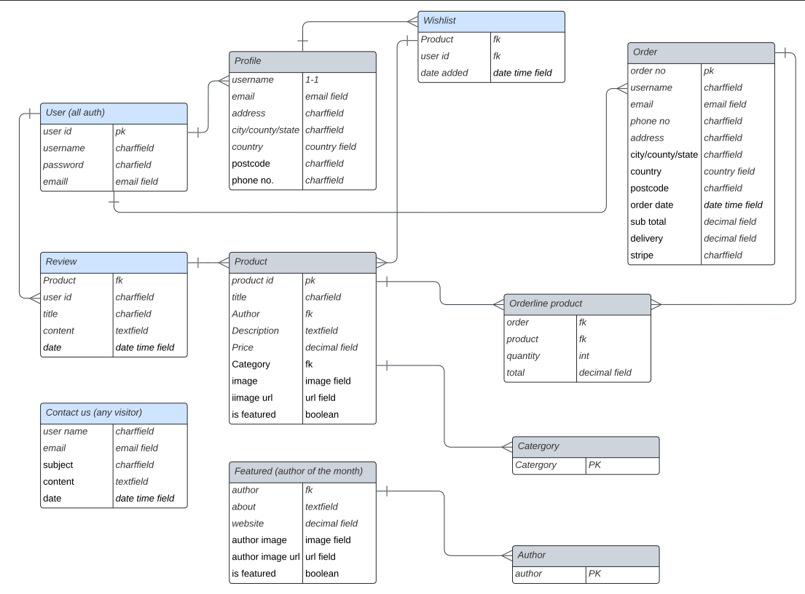
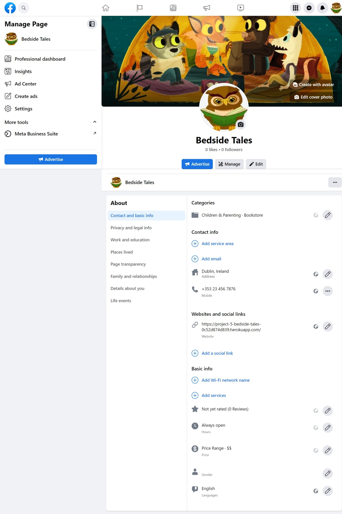

# Bedside Tales

Bedside Tales is an online children's book shop developed using Bootstrap, Django, Python, HTML, CSS and JavaScript.

Bedside Tales is a business to customer e-commerce site (B2C). It is designed for those who wish to find appropriate, inspiring bed time reading for children.

The site is deployed to Heroku. It uses Amazon S3 for cloud storage, ElephantSQL for the database and Stripe for payment processing.


[Go to Bedside Tales!](https://project-5-bedside-tales-0c52d874d839.herokuapp.com/)


* [User Experience (UX)](#User-Experience-(UX))
  * [User & Blog Goals](#User-&-Blog-Goals)
  * [Business model](#Business-model)
  * [Agile Methodology](#Agile-Methodology)
  * [Epics & User Stories](#Epics-&-User-Stories)

* [Design](#Design)
  * [Colour Scheme](#Colour-Scheme)
  * [Fonts](#Fonts)
  * [Imagery](#Imagery)
  * [Wireframes](#Wireframes)
  * [Database Model](#Database-Model)

* [Features & Feature Testing](#Features)
  * [Future features](#Future-features)

* [Marketing Stratergy](#Marketing-Stratergy)
  * [SEO](#seo)
  * [Social Media](#social-media)
  * [Email](#email)

* [Security Features & Defensive Design](#Security-Features-&-Defensive-Design)
  * [User Authentication](#User-Authentication)
  * [Form Validation](#Form-Validation)
  * [Database Security](#Database-Security)
  * [Custom Error Page](#Custom-Error-Page)

* [Technologies Used](#Technologies-Used)
  * [Languages Used](#Languages-Used)
  * [Django](#Django)
  * [Frameworks, Libraries & Programs Used](#Frameworks,-Libraries-&-Programs-Used)

* [Testing](#Testing)

* [Deployment](#Deployment)
  * [Create files / directories](#create-files--directories)
  * [Create the live database on ElephantSQL which can be accessed by Heroku](#create-the-live-database-on-ElephantSQL-which-can-be-accessed-by-heroku)
  * [Heroku app setup](#heroku-app-setup)
  * [Prepare env.py and settings.py files](#prepare-envpy-and-settingspy-files)
  * [Connect to Stripe](#Connect-to-Stripe)
  * [Connect to AWS](#Connect-to-AWS)
  * [Connect Django to S3 in AWS](#Connect-Django-to-S3-in-AWS)
  * [Update Heroku Config Vars](#update-heroku-config-vars)
  * [Deploy](#deploy)
  * [Local Deployment](#Local-Deployment)
  * [Remote Deployment](#Remote-Deployment)

* [Credits](#Credits)
  * [Code](#Code)
  * [Acknowledgements](#Acknowledgements)

- - -

## User Experience (UX)

### User & Blog Goals

#### Targeted User Goals:
* A user wanting to buy children's books.
* A user who wants to be able to view books by popular children's book genres.
* A user that can make use of additional features the site offers such as the wishlist and contact us form.

#### Site User Goals:
* For users to be able to interact with the site intuitively.
* For users to be able to access and view all books.
* For users to be able to clearly see the title, author, price and description.
* For users to be able to create an account to access additional functionality.
* For users to be able to contact us and sign up to a newsletter.
* For registered users to be able to log in and out of their account.
* For registered users to be able to leave a review on all books.
* For registered users to be able add and delete books to their wishlist.
* For registered users to be able to access their order history and save default info.

### Business model

Bedside Tales is a Business to Consumer (B2C) e-commerce site (B2C) which takes single payments. It is designed for those who wish to find appropriate, inspiring bed time reading for children.

### Agile Methodology

This blog was developed with agile planning. Each individual user feature was split into a user story. Each user story was defined and included an acceptance criteria. The acceptance criteria were tasks to mark as complete to complete the user story. 

Related user stories achieving a certain functionality of the site were grouped together in to Epics.

Each user story was labeled as Must Have, Should Have and Could Have to help prioritise which were most important to implement.

As the site evolved, tasks were added or updated, based on the changing needs / understanding of the what the site should provide the user.

This was implemented through Github Issues and the Kanban board in the projects view in Github. The project was divided into a few different sections:

* To Do - All user stories were initially entered in the 'To Do' column
* In Progress - During development stories were moved into the 'In Progress' column
* Done - On completion they get moved into the 'Done' column
* Future - Any 'could have' stories with features that I can look to implement at a later date, where due to time restraints I was unable to work on.

Please find my Kanban Board with my user stories [here](https://github.com/users/Sarohia94/projects/4/views/1).

### Epics & User Stories

**Epic 1: Website UI Features**

User Story #1

Search bar (must have) - As a Site User I can use a search bar to search for a book so that I see results of what I've searched for and the number of results.

Acceptance Criteria:
1. No of results displayed
2. Clickable items matching search results

User Story #2

View a list of books (must have) - As a site user I can view a list of books so that I can easily choose a book to look at

Acceptance Criteria

1. Books categorised and listed by genres
2. Book image, name, author, genre and price are clear
3. Able to click and view individual book detail

User Story #3

View book detail (must have) - As a site user I can click on a book item listed so that I can view further detail.

Acceptance Criteria

1. Clicking on book item listed opens a page where user can view further info on the product.
2. Option to add to bag or return to shop.

User Story #4

View promoted author (must have) - As a site user, I can find information on a promoted author/book so that I can make a decision to purchase.

Acceptance Criteria

1. Able to navigate to and view page on the promoted author/book
2. Able to learn something about the book(s) and author and navigate back to shop to make a purchase

User Story #5

Notifications (must have) - As a site user, I can view notifications in response to my actions so that I get confirmation my action has been made and acknowledged by the site.

Acceptance Criteria

1. Notifications appear in response to activity as appropriate
2. There is a option to dismiss notification 

User Story #6

Contact us form (should have) - As a site user, I can contact the store so that if I have a query I can raise it from the site.

Acceptance Criteria

1. Able to navigate to a contact us form
2. Able to submit the form and get confirmation this was sent

User Story #7

Social media & newsletter (must have) - As a site user, I can view the store's social accounts and sign up to the newsletter so that keep up with updates and get benefits.

Acceptance Criteria

1. I can access the links and they open in a separate tab.
2. I can subscribe to the newsletter

**Epic 2: Registration & Profile Features**

User Story #8 

Account Registration (must have) - As a site user I can register an account so that I can log in, have my account details saved and access other features.

Acceptance Criteria

1. As a site user, I intuitively know where to go to sign up and I can easily register my account without issue
2. Email confirmation on registration being successful
3. I can view my order history and details such as name, address and bank info are saved as default so I can make quicker purchases
4. Option to amend my profile details

User Story #9

Login & Logout (must have) - As a registered user, I can login and logout of the site so that I can have access to my account.

Acceptance Criteria

1. As a registered user, I can login and out successfully

User Story #10

Leave a book review (must have) - As a registered site user I can leave a review on a book.

Acceptance Criteria

1. As a logged-in user I can leave review on a book so that I can leave feedback for other users.

User Story #11

Wishlist for registered users (should have) - As a registered site user, I can add books to my wish list and easily view this on my profile.

Acceptance Criteria

1. As a logged-in user I can view a page with a view of all books added to my wish list.
2. As a logged-in user I can add to books on the site to my wish list and remove them too.

**Epic 3: Checkout Features**

User Story #12

Book items added to bag (must have) - As a site user, I can add books to my shopping bag so that I can make a purchase.

Acceptance Criteria

1. I can choose a quantity for each book to add to shopping bag.
2. I can view these added items in my shopping bag with key details and total displayed.
3. I can easily make changes to my shopping bag (changes to quantity or removing items) before checking out.

User Story #13

Payment (must have) - As a site user, I can easily enter my payment information so that I can checkout with no issues.

Acceptance Criteria

1. Personal and payment information required is clear and I feel secure in making the purchase.
2. View an order confirmation after checkout.
3. Recieve an email confirmation after completion.

- - -

## Design

The bootstrap template from the CI Boutique Ado walkthrough was used to help format the core website. Custom css styling and html was also used.

### Colour Scheme

The colour scheme was taken from [Coolors](https://coolors.co/). 

It was based on the image used for the hero image on the landing page which I thought was charming and fun for Bedside Tales.

The use of these colours have been consistently maintained throughout the website and checked for contrast to allow easy accessibility.


### Fonts

[Google Fonts](https://fonts.google.com/) were used as below:

* EB Garamond is used for the title.
* Lato is used for the body of the text. 
* San serif font is present as backup.

### Imagery

Images used were geared towards children to fit the theme and intention of the website, which is about selling books to children for great bed time reading.

Hero image and placeholder featured image for post was taken from [here](https://discover.fiverr.com/wp-content/uploads/10a66f553b99010724e17138d3732e6fb098966a-854x576.png), the Favicon icon from [Pinterest](https://nl.pinterest.com/pin/367958232047536824/) and all book images were from [Waterstones](https://www.waterstones.com/).

### Wireframes

Wireframes were created for destop/laptop, tablet and mobile.

* Home page wireframe can be found here for [desktop/laptop](docs/wireframes/laptop_desktop_book_home.png), here for [tablet](docs/wireframes/tablet_book_home.png) and here for [mobile](docs/wireframes/mobile_book_home.png).

* Book list page wireframe can be found here for [desktop/laptop](docs/wireframes/laptop_desktop_book_list.png), here for [tablet](docs/wireframes/tablet_book_list.png) and here for [mobile](docs/wireframes/mobile_book_list.png).

* Book view page wireframe can be found here for [desktop/laptop](docs/wireframes/laptop_desktop_book_view.png), here for [tablet](docs/wireframes/tablet_book_view.png) and here for [mobile](docs/wireframes/mobile_book_view.png).


### Database Model

Principles of object-oriented programming was used throughout this project and Django’s class-based generic views. Django AllAuth was used for user authentication. 

The project was created using the Django framework. Multiple apps were created; bag, checkout, home, other, products, profiles and wishlist.

4 custom models were developed for this project. Review model allows registered users to leave a review , Contact model for users to get in touch and Wishlist model for registered users to add or remove books from their wishlist and finally featured_author model to spotlight an author on the website. The other models were from the Boutique Ado walkthrough.



The product models was made to incorporate CRUD functionality. This allows users to add, edit quantity or remove books from bag. 

The admin has CRUD functionality both from the live site and from the Django database via the Django admin page to add, edit or remove books from the site. A custom Author model had to made as the existing Product model had a limitation that was not observed until later that did not allow for new Authors to be added from the same form.

- - -

## Features & Features Testing

See [TESTING.md](https://github.com/Sarohia94/Project-5-Bedside-Tales/blob/main/TESTING.md) document for features and feature testing.

### Future features

Due to time constraints I wasn't able to achieve all the features initially in mind during the planning phase. Future features are as follows:

* Registered users should be able to edit and delete their own reviews
* The Featured author of the month should have a direct link to the book in the shop and other media to make it more engaging.
* Make user's reviews and author's promoted books in to a feature to be displayed on the home or book pages.

- - -

## Marketing Stratergy

Employ SEO, Social Media and Email strategies to market Bedside Tales.

### SEO

Achieved via meta tags; meta description of content and key search words in base file. This is to optimize the website's visibility and improve search engine performance. The keywords will attract both search engines and users. In addition to this, sitemap.xml and robots.txt files are also included. Search engines use the xml file to help it understand the website's structure and how the pages link to each other. On the other hand the txt file tells the search engines where they aren't allowed to go on a website. These both improve SEO ranking for the website.

### Social Media

Achieved via a [Facebook business page](https://www.facebook.com/profile.php?id=61550751631784) as it has the largest number of users and the widest demographic.




### Email

Achieved via email subscription to a newsletter, powered by MailChimp. 

This is to provide additional benefit to subscribers by providing special offers, discounts and interesting articles on books and the authors to further engage the user if they sign up.

The subscription form can be found in the footer. Any user may subscribe to receive a newsletter. Users only need to provide an email address in order to subscribe to make a quick and easy subscription to avoid users changing their mind. A user will receive feedback confirming their subscription, or if there is invalid input then there will be feedback requesting a valid email address is provided. (There is not an actual email sent to user since it is out of the scope of the project)

- - -

## Security Features & Defensive Design

I have tried to use defensive programming throughout the site to prevent users accessing pages, submitting requests if they don't have the relevant permissions. 

### User Authentication

* Django's login_required is used to ensure that any requests to access secure pages by non-authenticated or non-admin users, are redirected to the login page.

* Check for authenticated users in templates by using the if statement i.e. , before allowing access (adding reviews) or visibility to links (My Account or Wishlist page).

### Form Validation

* Messages are present for fields forms where validation is required. If a user attempts to sign up or login without completing the relevant fields a message is displayed. User will not be able to sign in or login until all relevant fields are filled in.

* Similary when submitting an order if the required fields are not filled in then the user will be requested to ensure the form is completed and valid. This will not submit until all required fields are completed properly.

See [TESTING.md](https://github.com/Sarohia94/Project-5-Bedside-Tales/blob/main/TESTING.md) document.

### Database Security

The database url and secret key are stored in the env.py file to prevent unwanted connections to the database.

Cross-Site Request Forgery (CSRF) tokens were used on all forms throughout this site.

### Custom Error Page

This was created for when a user is trying to access a page that is not valid. This will give the user a link to return home.

* 404 Error - The requested page doesn't exist! 

See [TESTING.md](https://github.com/Sarohia94/Project-5-Bedside-Tales/blob/main/TESTING.md) document.

- - -

## Technologies Used

### Languages Used

HTML, CSS, Javascript, Django and Python.

### Django 
Django framework was used in this project:
* Gunicorn - as the server for Heroku.
* Amazon Web Services (AWS) - to host the static files and media for the site.
* Dj_database_url - to parse the database URL from the environment variables in Heroku.
* Psycopg2 - as an adaptor for Python and PostgreSQL databases.
* Allauth - for authentication, registration, account management.
* Crispy forms - provides a tag and filter that lets you quickly render forms.
* Pillow - python image processing library. To enable images to be viewed with the product model.
* Stripe - python web framework to set up payment processing.
* Django Countries - to use a drop-down list of Countries to choose from.
* JQuery code library.
* Boto3 - to connect Django to AWS and enable static files storage.
* Django-Storages - to connect Django to AWS.

### Frameworks, Libraries & Programs Used
* [Am I responsive?](https://ui.dev/amiresponsive) - to show across a range of devices.
* Git - for version control. 
* GitHub - to save and store the code pushed from Git.
* GitPod - using GitPod terminal to commit to Git and push to GitHub.
* GitHub Projects - to support the Agile development of the website.
* Balsamic - to create the wireframes when designing the website.
* Dev Tools - for testing and troubleshooting.
* [Google Fonts](https://fonts.google.com/) - to import font to apply on the website.
* [Font Awesome](https://fontawesome.com/) - to add icons.
* [Wave](https://wave.webaim.org/) - to test web accessibility.
* [W3C](https://validator.w3.org/) - HTML validator.
* [Jigsaw](https://jigsaw.w3.org/css-validator/) - CSS validator.
* [JSHint](https://jshint.com/) - a tool that helps to detect errors and potential problems in JavaScript code.
* [Tiny PNG](https://tinypng.com/) - to compress images.
* [Responsive design checker](https://responsivedesignchecker.com/) - to check responsive design for a variety of screen sizes.
* [Favicon.io](https://favicon.io/favicon-generator/) - to creat favicon icon for the website.
* Django - a high-level Python web framework that encourages rapid development.
* Bootstrap - a framework for building responsive, mobile-first sites.
* Heroku - used to deploy and host the live project.
* PostgreSQL - database used through heroku.
* ElephantSQL - PostgreSQL database hosting of the project.
* LucidChart - ERD Design and layout software.

- - -

## Testing 

Details of all testing done can be viewed in depth in the [TESTING.md](https://github.com/Sarohia94/Project-5-Bedside-Tales/blob/main/TESTING.md) document.

- - -

## Deployment 

The site is deployed to Heroku, uses Amazon S3 for cloud storage, ElephantSQL for the database and Stripe for payment processing.

### Create files / directories
1. Create a requirements.txt file
2. Create directories in the main directory
3. Create a "Procfile" in the main directory and add the following: web: gunicorn project_name.wsgi (Heroku needs a Procfile so it knows how to run a project)

### Create the live database on ElephantSQL which can be accessed by Heroku:

Heroku uses an ephemeral file system, which means it is wiped clean every time Heroku updates, or every time the app is redeployed. So Gunicorn will act as the web server for the project, and the project will also use a server-based database called 'Postgres' as the sqlite3 database that came with Django is only available for use in development. We need to create a new database that is suitable for production. As it will be separated from the application, it will survive even if the application server is destroyed.

1. Assuming you already have an account, go to the ElephantSQL dashboard and click the create new instance button on the top right.
2. Name the plan (i.e. your project name), select the tiny turtle plan (which is the free plan) and choose the region that is closest to you then click the review button.
3. Check the details are all correct and then click create instance in the bottom right.
4. Go to the dashboard and select the database just created.
5. Copy the URL.

### Heroku app setup

1. Assuming you already have an account, from the Heroku dashboard, click the new button in the top right corner and select create new app.
2. Give your app a unique name, select the region that is closest to you and then click the create app button bottom left.
3. Open the settings tab and create a new config var of DATABASE_URL and paste the database URL you copied from ElephantSQL into the value (remove quotation marks from value).

### Prepare env.py and settings.py files

1. Generate a SECRET_KEY. Django will have automatically created a SECRET_KEY but for security reasons change this secret key using a secret key generator. Go to miniwebtool's Django Secret Key Generator, click on the Generate Django Secret Key button and copy the value.

Go to your Heroku app dashboard, open the settings tab and click Reveal Config Vars
Create a new Config Var SECRET_KEY and give it the value of the newly generated secret key and then click add.

Open your project's settings.py file and add:
```python
SECRET_KEY = os.environ.get('SECRET_KEY', '')
```
2. In your GitPod workspace, create an env.py file in the main directory and update as appropriate:
```python
 import os
os.environ["DEVELOPMENT"] = "1"
os.environ["DATABASE_URL"] = "ElephantSQL database URL"
os.environ["SECRET_KEY"] = "value"
```
3. Install the dj-database-url package version 0.5.0 and psycopg2 in the terminal with pip3 to allow us to parse the URL we have copied above to a format that Django can work with:
```bash
pip3 install dj_database_url==0.5.0 psycopg2
pip3 freeze > requirements.txt
```
4. Update the settings.py file to import the env.py file:
```python
import os
if os.path.exists("env.py"):
  import env
import dj_database_url
```
5. Comment out default database configuration.
```python
if 'DATABASE_URL' in os.environ:
    DATABASES = {
        'default': dj_database_url.parse(os.environ.get('DATABASE_URL'))
    }
else:
    DATABASES = {
        'default': {
            'ENGINE': 'django.db.backends.sqlite3',
            'NAME': os.path.join(BASE_DIR, 'db.sqlite3'),
        }
    }
```
6. Run the showmigrations command in the terminal to confirm you are connected to the external database
```bash
python3 manage.py showmigrations
```
**Note:** this does not transfer the data, only the database structure. If you are connected to the external database, you should see a list of migrations, but none of them will be checked off. Run the migrate command in the terminal.
```bash
python3 manage.py migrate
```
7. Temporarily disable collectstatic by updating Heroku config vars as DISABLE_COLLECTSTATIC=1 to tell Heroku not to collect static files when we deploy.
8. Add Heroku to the ALLOWED_HOSTS list the format ['app_name.heroku.com', 'localhost']
9. Create a superuser for your new database: 
```bash
python3 manage.py createsuperuser
```
Follow the steps to create your superuser username and password.

10. Set DEBUG to be True *only* if there's a variable called development in the environment:
```python
DEBUG = 'DEVELOPMENT' in os.environ
```

### Connect to Stripe
1. Assuming you already have an account, log in to Stripe, click the developers link, and then API Keys.
2. Add the key values as Config Vars in Heroku to connect the deployed project to Stripe
3. Create a new webhook endpoint, click developers -> webhooks, select the 'add endpoint' link
4. Add the URL for our Heroku app, followed by '/checkout/WH/' and select 'receive all events' then click 'add endpoint'.
5. Reveal the webhooks signing secret and add that as the value to the STRIPE_WH_SECRET config var in the Heroku app's Deploy tab

### Connect to AWS 
1. Go to aws.amazon.com Login, or create an AWS Account to host static files and images
2. Select S3.
3. Click on 'Create Bucket' to create a new storage bucket.
4. Name the new bucket - ideally following the same naming convention as the project.
5. On the **Object Ownership** section, select ACLs enabled. A bucket ownership dropdown will appear, select 'bucket owner preferred'.
6. On the **Block Public Access** settings, uncheck block all public access on and acknowledge that the bucket will be public (in order to allow public access to our static files) and click *create bucket*.
7. Click the bucket you created and select the **Properties** tab. Scroll down to the bottoms to find the **Static Web Hosting** section and select 'enable static web hosting', tick 'host a static website' and add index.html and error.html to the input fields for Index document and Error document respectively.
8. On the **Permissions** tab paste in a coors configuration which is going to set up the required access between our Heroku app and this s3 bucket.
```json
[
  {
      "AllowedHeaders": [
          "Authorization"
      ],
      "AllowedMethods": [
          "GET"
      ],
      "AllowedOrigins": [
          "*"
      ],
      "ExposeHeaders": []
  }
]
```
9. On the **Permissions** tab copy the ARN (Amazon Resource Name). Go to the **Bucket Policy** section, click edit and select policy generator. From the 'select type policy' dropdown options, select S3 bucket policy.  Add * to the input to allow all principal. From the 'actions' dropdown, select 'GetObject'.
10. Paste the ARN we copied into the ARN (Amazon Resource Name) input field and click 'add statement', then click generate policy. Copy the Policy from the new popup and paste it into the bucket policy editor and add /* at the end of the resource value to allow access to all resources in this policy. So our bucket policy and CORS configuration will now allow full access to all resources in this bucket.
11. For the **Access control list (ACL)** section, click 'edit' and enable List for Everyone (public access) and accept the warning box. If the edit button is disabled, you need to change the Object Ownership section above to ACLs enabled.
12. Create an **Identify and Access Management (IAM) User Group**. In this we will create the policy used to access our S3 bucket, and create a User to access the S3 bucket. This static files user will have access keys which will be used to connect the bucket to our deployed app on Heroku via config var keys. 
* Start by creating a group by selecting **User Groups** and click *create group*.
* Add a name for your group, then click *create policy* button.
* Open the *JSON* tab on the new page and click the *import managed policy* link on the top right side of the page.
* Search for S3 and select the pre-built *AmazonS3FullAccess* policy and click *import*.
* Edit the policy by pasting the S3 ARN on *resource*, ie:
```json
{
    "Version": "2012-10-17",
    "Statement": [
        {
            "Effect": "Allow",
            "Action": "s3:*",
            "Resource": [
                "arn:aws:s3:::bucket-name",
                "arn:aws:s3:::bucket-name/*",
            ]
        }
    ]
}
```
* Click the *next* button and then *next: review*
* Give the policy a name, description then click the *create policy* button
* Next we need to attach to the Group the policy we just created. Go to *User Groups*, select the group and go to the permissions tab, click the *add permissions* button and select *attach policies* from the dropdown.
* Select the Policy you created and click *add permissions*
* We have to create a user for the group. Click *Users* from the left sidebar and then click the *add users* button and add a name for the user.  By assigning a user to the group it can use the policy to access all our files.
* Next tick *programmatic access* from Access Type and click *next: permissions*
* Add user to the group and click *next: tags*, *next: review* and then the *create user* button.
* The download the .csv file which will contain this user's access key and secret access key which we'll use to authenticate them from our Django app.

### Connect Django to S3 in AWS 
1. Install two packages in the terminal, Boto and Django Storages, and add settings, via keys, to tell our project which bucket it should be communicating with. These keys will be added to the Config Vars in Heroku.
```bash
pip3 install boto3
pip3 install django-storages
pip3 freeze > requirements.txt
```
* Add `storages` to the installed apps in **settings.py**
* Also on **settings.py**, add the bucket configuration:
```python
    if 'USE_AWS' in os.environ:
        AWS_S3_OBJECT_PARAMETERS = {
          'Expires': 'Thu, 31 Dec 2099 20:00:00 GMT',
          'CacheControl': 'max-age=94608000',
    }

        AWS_STORAGE_BUCKET_NAME = 'bucket name goes here'
        AWS_S3_REGION_NAME = 'selected region goes here'
        AWS_ACCESS_KEY_ID = os.environ.get('AWS_ACCESS_KEY_ID')
        AWS_SECRET_ACCESS_KEY = os.environ.get('AWS_SECRET_ACCESS_KEY')
        AWS_S3_CUSTOM_DOMAIN = f'{AWS_STORAGE_BUCKET_NAME}.s3.amazonaws.com'
```
2. Tell Django, via settings.py, that in production we want to use S3 to store our static files and our media files whenever someone runs collectstatic, and that we want any uploaded product images to go there also, all via custom classes in custom_storage.py.

* Create **custom_storages.py** file and add:
```python
from django.conf import settings
from storages.backends.s3boto3 import S3Boto3Storage


class StaticStorage(S3Boto3Storage):
    location = settings.STATICFILES_LOCATION


class MediaStorage(S3Boto3Storage):
    location = settings.MEDIAFILES_LOCATION
```
* Next, back to **settings.py** file and tell it that for static file storage, we want to use our storage class we just created and that the location it should save static files is a folder called static. And then do the same thing for media files using the default file storage and media files location settings.
```python
    # Static and media files
    STATICFILES_STORAGE = 'custom_storages.StaticStorage'
    STATICFILES_LOCATION = 'static'
    DEFAULT_FILE_STORAGE = 'custom_storages.MediaStorage'
    MEDIAFILES_LOCATION = 'media'
```
* We also need to override and explicitly set the URLs for static and media files using our custom domain and the new locations:
```python
    # Override static and media URLs in production
    STATIC_URL = f'https://{AWS_S3_CUSTOM_DOMAIN}/{STATICFILES_LOCATION}/'
    MEDIA_URL = f'https://{AWS_S3_CUSTOM_DOMAIN}/{MEDIAFILES_LOCATION}/'
```
* Next, save the **settings.py** file, add all these changes, commit them and then issue a git push which should trigger an automatic deployment to Heroku. With that done if we look at the build log. We can see that all the static files were collected successfully.
3. Create a Media folder within the S3 bucket into which we upload all images used in our project, and grant them public-read access.

### Update Heroku Config Vars
Add the following Config Vars in Heroku:
* AWS_ACCESS_KEY_ID = 'access key generated by AWS'
* AWS_SECRET_ACCESS_KEY = 'secret key generated by AWS'
* DATABASE_URL = 'ElephantSQL URL'
* EMAIL_HOST_PASS = 'secret key generated by email provider'
* EMAIL_HOST_USER = 'your email'
* SECRET_KEY = 'your secret key from Gitpod'
* STRIPE_PUBLIC_KEY = 'public key generated by Stripe'
* STRIPE_SECRET_KEY = 'secret key generated by Stripe'
* STRIPE_WH_SECRET = 'Webhook secret key generated by Stripe'
* USE_AWS = 'True'
* DISABLE_COLLECTSTATIC = '1'

### Deploy

1. Make sure "DEBUG = 'DEVELOPMENT' in os.environ" in the settings.py
2. Remove config vars DISABLE_COLLECTSTATIC = 1 from Heroku settings.
3. Go to the deploy tab on Heroku and connect to GitHub, then to the required repository.
4. Scroll to the bottom of the deploy page and either click Enable Automatic Deploys for automatic deploys or Deploy Branch to deploy manually. Please note, manually deployed branches will need re-deploying each time the GitHub repository is updated.
5. Click 'Open App' to view the deployed live site.

The site is now live and operational.

### Local Deployment

#### How to Clone
1. Sign up or log in to GitHub
2. Go to the repository https://github.com/Sarohia94/Project-5-Bedside-Tales/
3. Go to the code dropdown and select how you'd like to clone and copy the link provided
4. Go to the new repo and enter in your workspace terminal, "git clone" (without quotes) followed by the link copied
5. Install necessary libraries/frameworks to the terminal 
6. Enter the following command "pip3 freeze > requirements.txt" (without quotes) to the terminal to install the libraries/frameworks dependencies which will be required if this is deployed to Heroku
7. Enter command "python3 manage.py runserver run.py" (without quotes) to run the browser.

#### How to Fork
1. Sign up or log in to GitHub
2. Go to the repository https://github.com/Sarohia94/Project-5-Bedside-Tales/
3. Click on the fork button towards the top right of the page 

### Remote Deployment
The website was deployed to GitHub Pages as follows:
1. Log in to GitHub
2. Assuming you have cloned or forked the repository, go on the "Settings" link for this repository
3. Click on the "Pages" link on the left hand side of the page
4. Under "Source" select "Deploy from branch" from the dropdown
5. Under "Branch" select "main" from the dropdown
6. Click "Save" which will then refresh the page
7. It might take a few mins before you can refresh and view the link to the site published

- - -

## Credits

### Code

For general guidance and trouble shooting:
* W3Schools
* Django Docs
* [Bootstrap Docs](https://getbootstrap.com/docs/5.2/getting-started/introduction/)
* Stack Overflow
* Youtube videos by Codemy
* Youtube video by [Coding is thinking](https://www.youtube.com/watch?v=x8kQ_Voa1pk) for contact form.
* Youtube demo by [Tech2 etc](https://www.youtube.com/watch?v=P8YuWEkTeuE&list=WL&index=14)
* Webhook trouble shooting for [what to do when the HTTP status code starts with a four (4xx) or five (5xx) : Stripe: Help & Support](https://support.stripe.com/questions/webhooks-what-to-do-when-the-http-status-code-starts-with-a-four-%284xx%29-or-five-%285xx%29) and 
[what to do when the HTTP status code starts with a three (3xx) : Stripe: Help & Support](https://support.stripe.com/questions/webhooks-what-to-do-when-the-http-status-code-starts-with-a-three-%283xx%29).

* Credit to Code Institute - Boutique Ado Walkthrough Project for forming the basis of this project.
* Credit to [JoyZadan](https://github.com/JoyZadan/shop-kbeauty) for inspiration and reference particularly readme and wishlist
* Credit to [farah-maria](https://github.com/farah-maria/LeabharMaith/) for inspiration on MVP and particularly for contact form.
* Credit to [MoniMurray](https://github.com/MoniMurray/bookworms-et-al) for inspiration and reference.

Images creditted as follows:
* Hero image and placeholder featured image for post was taken from [here](https://discover.fiverr.com/wp-content/uploads/10a66f553b99010724e17138d3732e6fb098966a-854x576.png).
* The Favicon icon was taken from [Pinterest](https://nl.pinterest.com/pin/367958232047536824/) 
* All book images were from [Waterstones](https://www.waterstones.com/).

### Acknowledgements 
Thank you to anyone taking the time to view my project. Special thanks to the Slack community and the below individuals:
* [Chris Quinn](https://github.com/10xOXR) and Martina Terlevic, my subsitute mentor on this last project. Thank you for your guidance and feedback.
* To the tutors from tutor support for their help and assistance.