# Bedside Tales | Testing

Return to [README](https://github.com/Sarohia94/Project-5-Bedside-Tales/blob/main/README.md)

* [Features](#Features)
* [Issues](#Issues)
* [PEP8](#PEP8)
* [W3C Validator](#W3C-Validator)
* [Manual Testing](#Manual-Testing)
* [Accessibility](#Accessiblity)
* [Lighthouse Testing](#lighthouse-testing)
* [User Validation Testing](#User-Validation-Testing)

- - -

## Features 

Below are the main features the user will come across 

1. Favicon logo is displayed for the book shop.

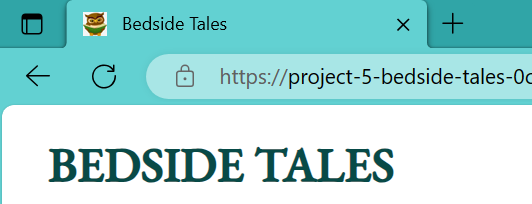

2. Navbar is present at the top of every page and includes all links to the other pages on mobile and larger screen sizes. Clicking on the book shop name takes you back to the home page. Hovering over the link changes the colour.

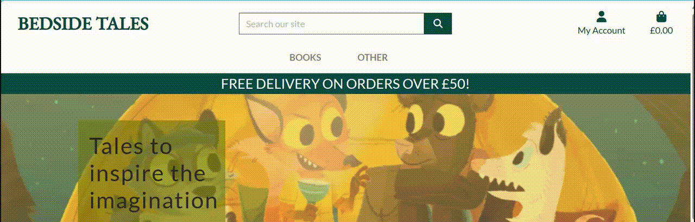

3. Only when a user is logged in, can they view the wishlist and my profile. Only site admin can view these features and book management.

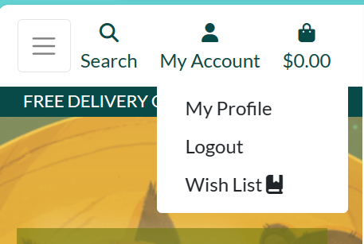

4. The navbar is fully responsive and collapses into a hamburger menu icon on smaller screen sizes. When the hamburger is clicked, the menu options open on the right-hand side.

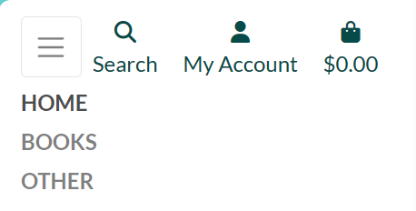

5. Footer includes working links to Facebook, Twitter & Instagram. Clicking each link will open a separate browser page to the login of that website. 

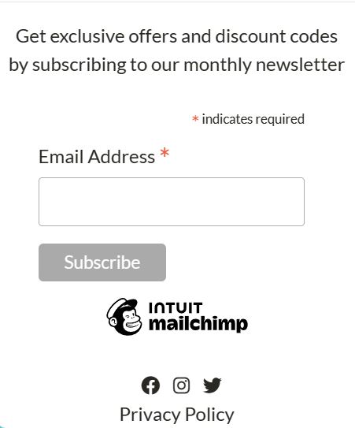

6. The Facebook Link should direct you to Facebook page for the shop for the purpose of digital marketing. If it has since been removed please see screenshot evidence below. 

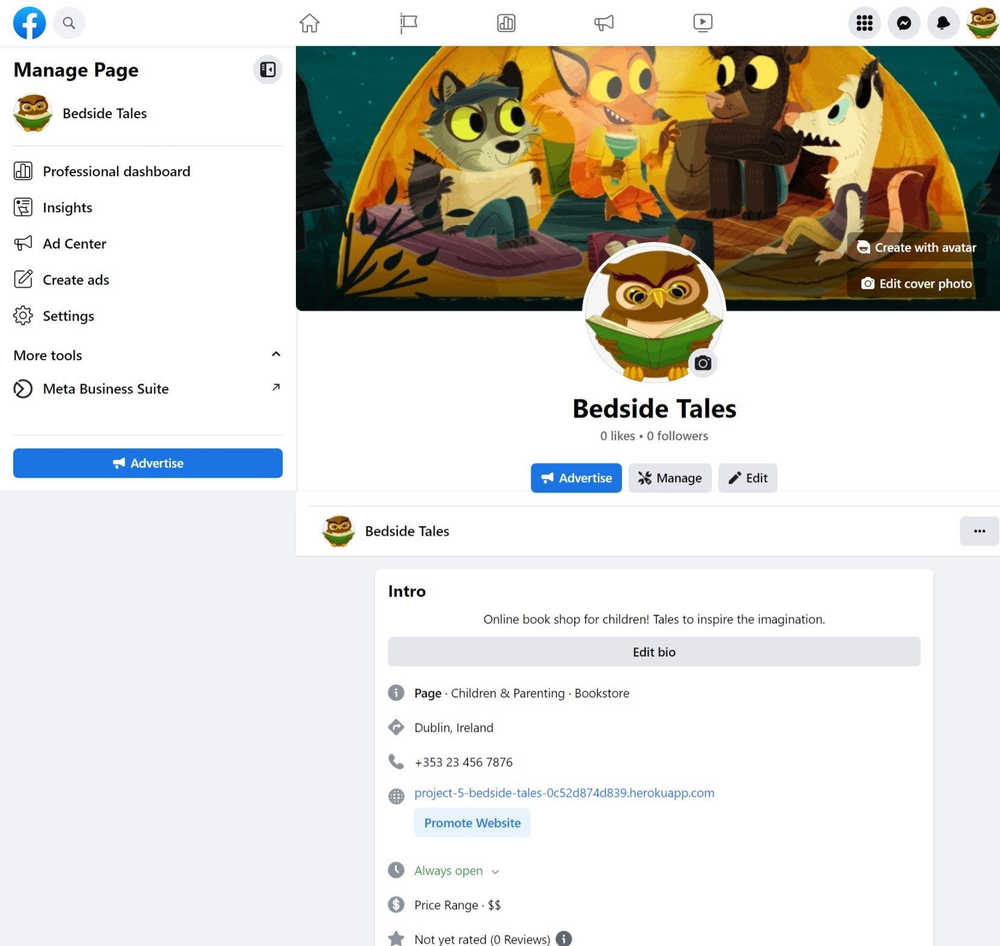

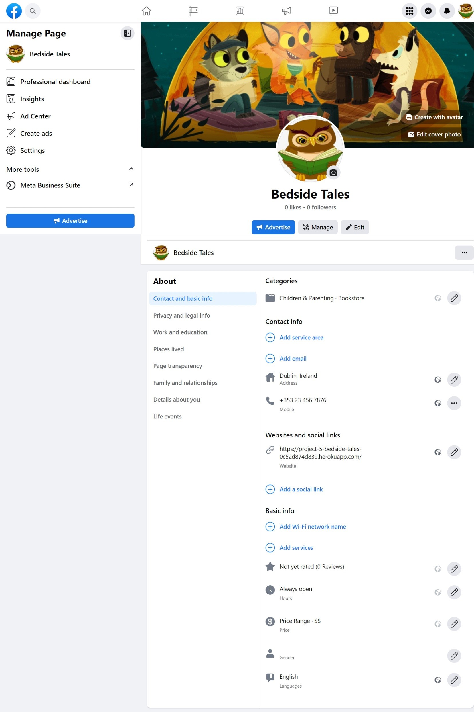

7. The footer section has a feature to subscribe to the shops newsletter using mailchimp. A success message is displayed to confirm this has request has been received.

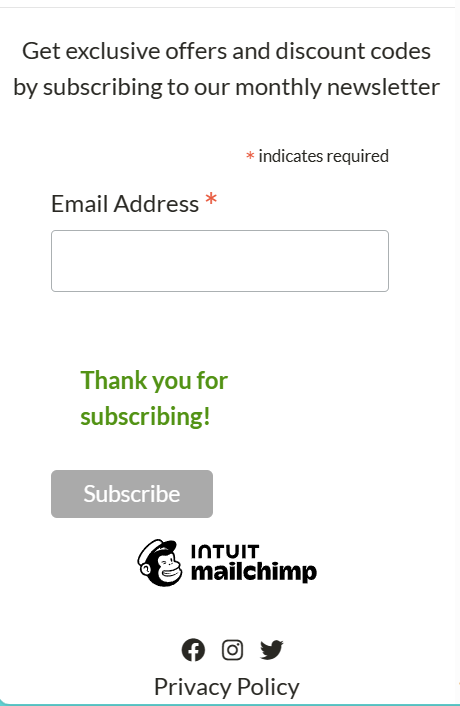

8. There is link to a privacy policy too created using the free [Privacy Policy generator](https://www.privacypolicygenerator.info/). This again opens on a separate tab.

9. The free delivery over £50 marketing banner is present throughout the site to inform the user of this marketing offer.

10. On the home page we have our hero image which enforces what the shop is selling and a big show now button that changes the colour and on clicking displays all books.

11. The search icon expands on clicking on smaller screen and displays results matching the title name or description.

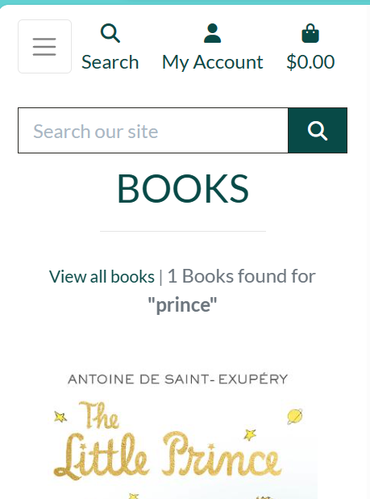

12. Clicking on a book catergory will display the Catergory you are looking at, with the results - each book has the tag displayed confirming this too. There is also a link to view all books and a quantity of the results displayed on the first page.

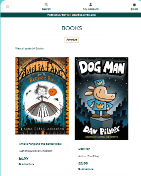

13. Each book view from the catergories or search result has a clickable image to view the book, with title, author, price and category displayed and matching the search.

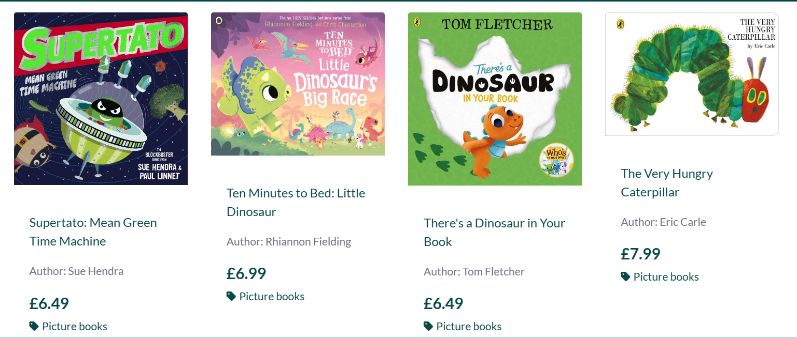

14. The book view displays the same features as above but the image is clickable and opens on a new tab. It also has additional features such as book description, an external link to Goodreads (for futher info/reviews) and a add to wishlist option (which only works for logged in users).

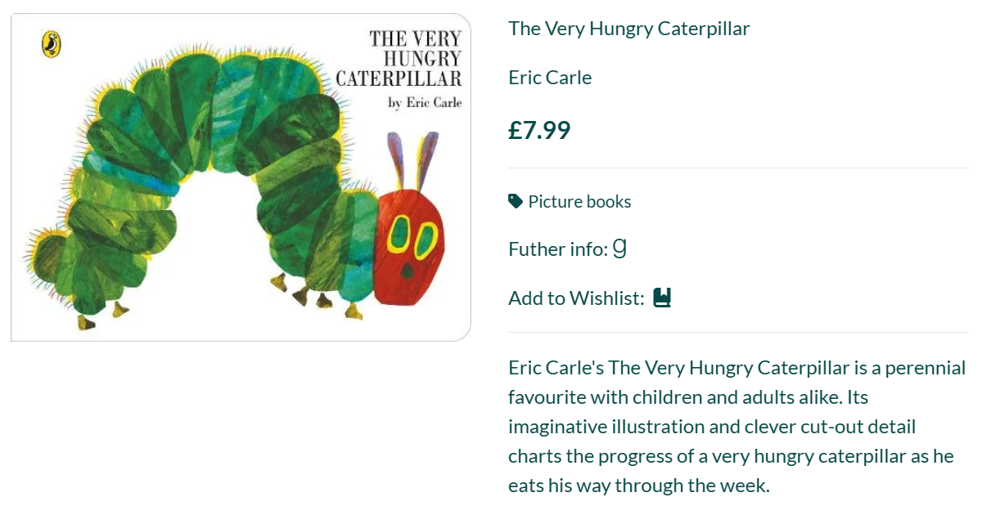

15. The book view has buttons to increase or decrease quantity or you can manually type in or use the inbuilt up and down arrows. There is also the option to return to the shop or add item to bag.

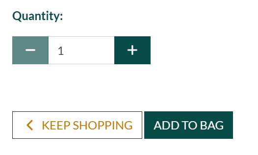

16. The book view also gives an option for any user to read a review if left. If there are no reviews added there is comment to confirm such. A comment is also left for users to login or signup to add a review. For logged in users they have a form (custom model) to add a review.

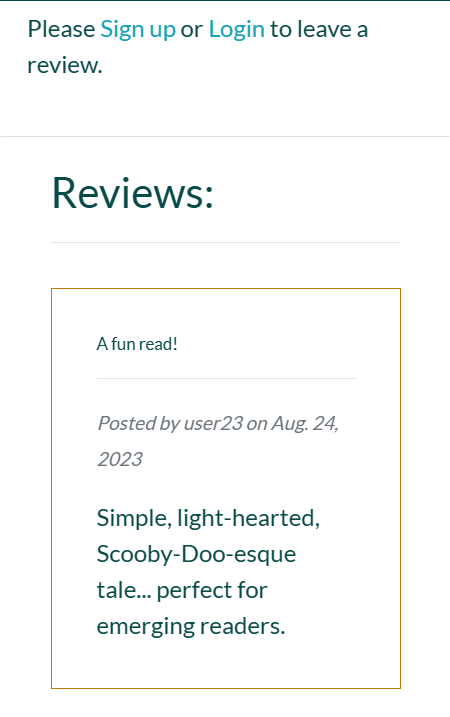

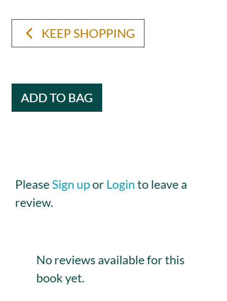

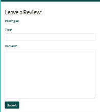

17. Adding books to the bag will update the shopping bag item with the grandtotal and display a success message with a preview of the back, how much to spend to qualify for free delivery and a checkout button.

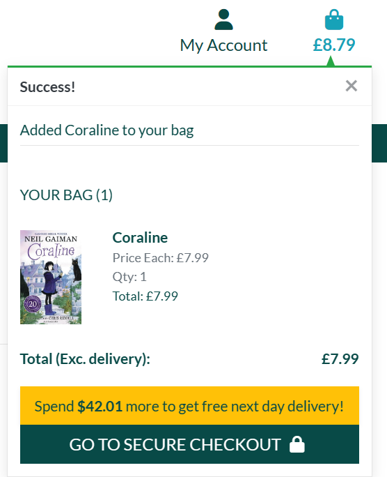

18. Under "Other" link we have an author of the month page (custom model) which will display an author (name, image & description) depending on who is added and marked as "is featured" in the admin. There is a button to send the user to the shop.

19. Again under "Other" we have a contact us form (custom model) for any user to get in contact with the store for feedback or queries. The form submitted by user can they be viewed in the admin by the admin.

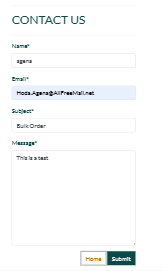

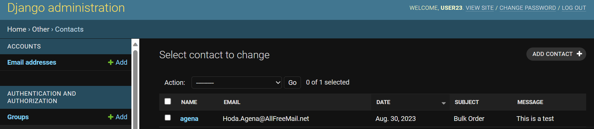

20. The sign up, sign in, forgot password and sign out pages all display as expected and all links work.

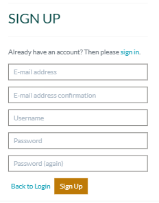

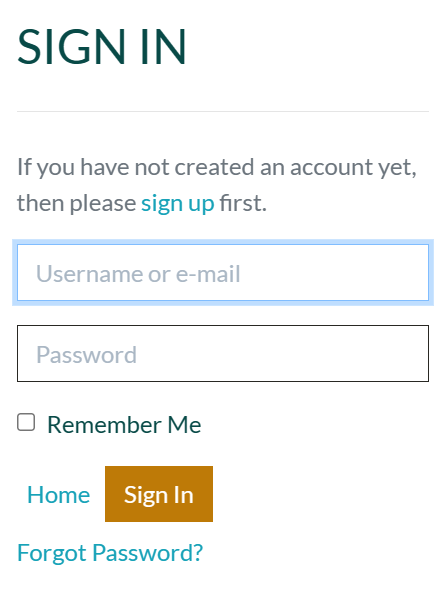

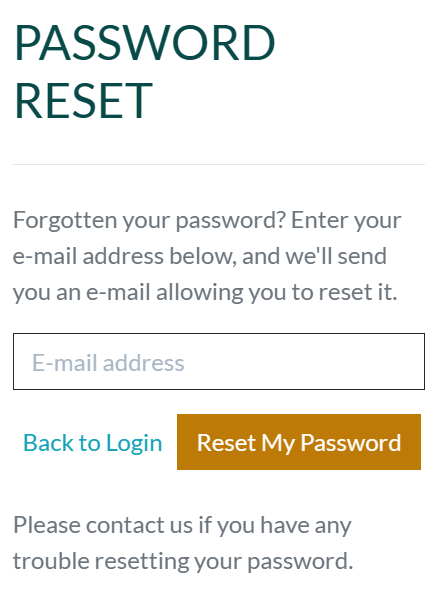

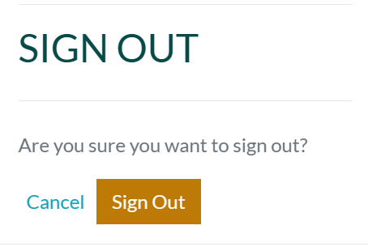

21. Logged in users can go to "my profile" and find a message welcoming them by username and directing them to wishlist, option to view/update default info (saved for quicker checkout) and their order history. Clicking on the order no link takes the user back to original order confirmation message.

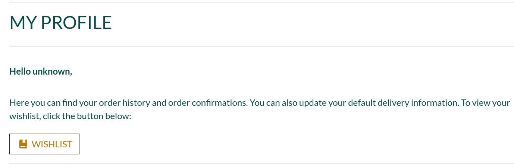

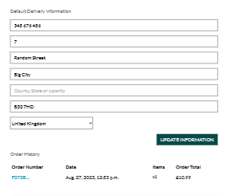

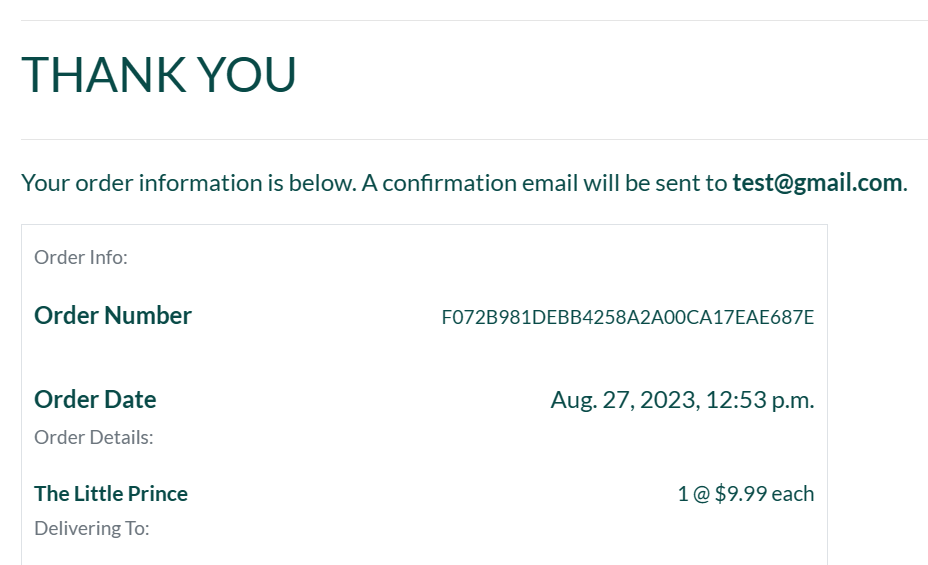

22. There is also a link to view the wishlist from "My Account" rather than "My Profile" for logged in users. If there are no books added there is a comment otherwise the this is displayed with the image, title, price and clickable icons to view or remove from list. Removing or viewing the wishlist book will return the user to the books page.

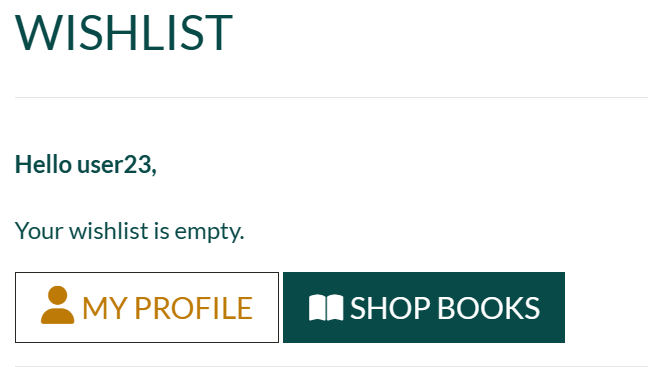

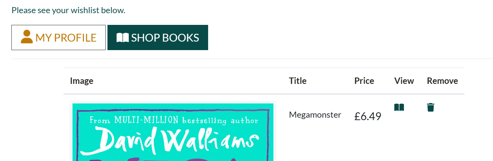

23.From shopping bag pag the contents are surmised. Once again the user is able to amend the quantity (by the buttons then update) or remove books from here and the total and delivery charge and note will update. There is options to return to shop or move on to the next stage of making the payment.

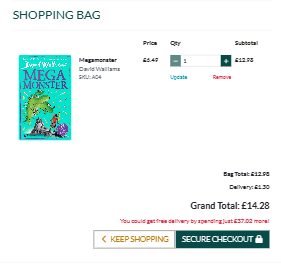

24. Users don't have to be logged in to make payment but if they are then there default saved information from their profile will already have the address and number details pre filled in.
Payment is processed using stripe. A blue screen overlay with a spinner is displayed to denote the order and payment is being processed.

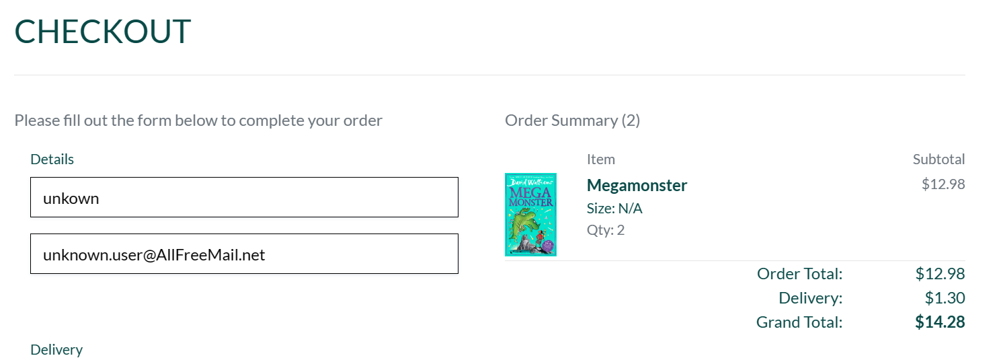

25. Order confirmation follows once payment is made confirming details and thanking the user with a button to return back to shop. Again this order will be found on the profile under order history.

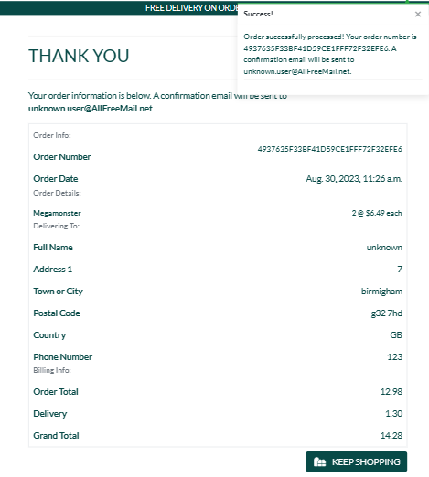

26. There is a scroll to top arrow button on the shopping bag and book list page to for easy navigation.

27. Finally there is "Book Management" under "My Account" for admin users who can add a book to the site from the site and also add a new author (custom models). On each book in the book shop the admin user will be able to edit or remove the book from the site as well as the admin.

- - -

## Issues

