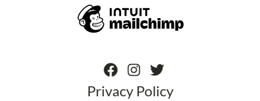
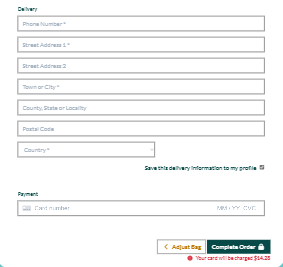
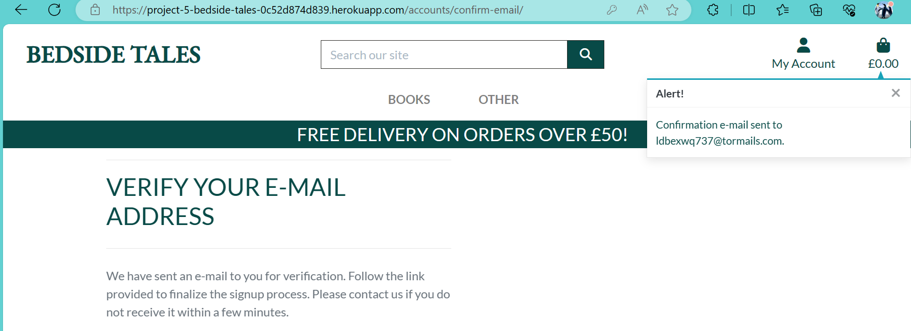
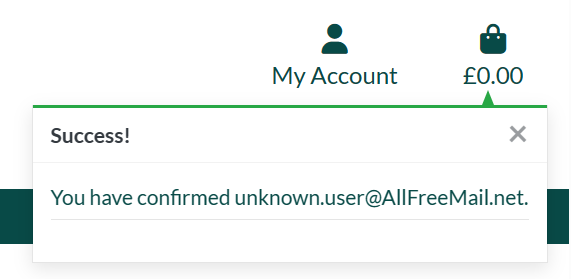

# Bedside Tales | Testing

Return to [README](https://github.com/Sarohia94/Project-5-Bedside-Tales/blob/main/README.md)

* [Features](#Features)
* [Issues](#Issues)
* [PEP8](#PEP8)
* [JSHint](#JSHint)
* [W3C Validator](#W3C-Validator)
* [Manual Testing](#Manual-Testing)
* [Accessibility](#Accessiblity)
* [Lighthouse Testing](#lighthouse-testing)
* [User Validation Testing](#User-Validation-Testing)

- - -

## Features 

Below are the main features the user will come across 

1. Favicon logo is displayed for the book shop.


2. Navbar is present at the top of every page and includes all links to the other pages on mobile and larger screen sizes. Clicking on the book shop name takes you back to the home page. Hovering over the link changes the colour.


3. Only when a user is logged in, can they view the wishlist and my profile. Only site admin can view these features and book management.


4. The navbar is fully responsive and collapses into a hamburger menu icon on smaller screen sizes. When the hamburger is clicked, the menu options open on the right-hand side.


5. Footer includes working links to Facebook, Twitter & Instagram. Clicking each link will open a separate browser page to the login of that website. 


6. The Facebook Link should direct you to Facebook page for the shop for the purpose of digital marketing. If it has since been removed please see screenshot evidence below. 


7. The footer section has a feature to subscribe to the shops newsletter using mailchimp. A success message is displayed to confirm this has request has been received.


8. There is link to a privacy policy too created using the free [Privacy Policy generator](https://www.privacypolicygenerator.info/). This again opens on a separate tab.



9. The free delivery over £50 marketing banner is present throughout the site to inform the user of this marketing offer.


10. On the home page we have our hero image which enforces what the shop is selling and a big show now button that changes the colour and on clicking displays all books.


11. The search icon expands on clicking on smaller screen and displays results matching the title name or description.


12. Clicking on a book catergory will display the Catergory you are looking at, with the results - each book has the tag displayed confirming this too. There is also a link to view all books and a quantity of the results displayed on the page.


13. Each book view from the catergories or search result has a clickable image to view the book, with title, author, price and category displayed and matching the search.


14. The book view displays the same features as above but the image is clickable and opens on a new tab. It also has additional features such as book description, an external link to Goodreads (for futher info/reviews) and a add to wishlist option (which only works for logged in users).


15. The book view has buttons to increase or decrease quantity or you can manually type in or use the inbuilt up and down arrows. There is also the option to return to the shop or add item to bag.


16. The book view also gives an option for any user to read a review if left. If there are no reviews added there is comment to confirm such. A comment is also left for users to login or signup to add a review. For logged in users they have a form (custom model) to add a review.


17. Adding books to the bag will update the shopping bag item with the grandtotal and display a success message with a preview of the back, how much to spend to qualify for free delivery and a checkout button.


18. Under "Other" link we have an author of the month page (custom model) which will display an author (name, image & description) depending on who is added and marked as "is featured" in the admin. There is a button to send the user to the shop.


19. Again under "Other" we have a contact us form (custom model) for any user to get in contact with the store for feedback or queries. The form submitted by user can they be viewed in the admin by the admin.


20. The sign up, sign in, forgot password and sign out pages all display as expected and all links work.


21. Logged in users can go to "my profile" and find a message welcoming them by username and directing them to wishlist, option to view/update default info (saved for quicker checkout) and their order history. Clicking on the order no link takes the user back to original order confirmation message.


22. There is also a link to view the wishlist from "My Account" rather than "My Profile" for logged in users. If there are no books added there is a comment otherwise the this is displayed with the image, title, price and clickable icons to view or remove from list. Removing or viewing the wishlist book will return the user to the books page.


23.From shopping bag pag the contents are surmised. Once again the user is able to amend the quantity (by the buttons then update) or remove books from here and the total and delivery charge and note will update. There is options to return to shop or move on to the next stage of making the payment.


24. Users don't have to be logged in to make payment but if they are then there default saved information from their profile will already have the address and number details pre filled in.
Payment is processed using stripe. A blue screen overlay with a spinner is displayed to denote the order and payment is being processed.




25. Order confirmation follows once payment is made confirming details and thanking the user with a button to return back to shop. Again this order will be found on the profile under order history.


26. There is a scroll to top arrow button on the shopping bag and book list page to for easy navigation.

27. Finally there is "Book Management" under "My Account" only for admin users who can add a book to the site from the site and also add a new author (custom models). On each book in the book shop the admin user will be able to edit or remove the book from the site as well as the admin.

- - -

## Issues

### Known bugs

Following testing, these issues are the unresolved bugs I am unaware of. Due to time constraints I was unable to resolve.

1. User input for quantity is validated on the product detail page. It will not allow user to add to bag for value below 1 nor greater than 100. However from the checkout bag, if user manually amends to 0 and updates the item is removed and likewise if they manually amend to a figure above 100 it will update.

2. On the checkout page the form will submit when text is submitted in the phone no. field

### Resolved bugs

1. Category menu items were not rendering. Martin from tutor support helped me to understand that these are case sensitive and have to match the admin. I then had the issue of w3c error due to space in "Picture book", this was amended following the [stackoverflow](https://stackoverflow.com/questions/497908/is-a-url-allowed-to-contain-a-space) post.


2. Unable to view shopping bag for screen sizes larger than mobile using dev tools. Oisin from tutor support helped me identify the issue was with my html tags, the table for large screens was being rendered but it was nested within the div that was displayed on smaller screens.


3. Get reviews to display just on the product where a review is added. But the issue I had was that any review added was displayed to all products.  
I was able to get to the below but I got a TypeError: cannot unpack non-iterable Product object
```python
Review.objects.filter(product).order_by("-date")
```
Sarah from tutor support was able to provide rationale on which part of the code to look at and what I was asking it to do.
Django doesn't know what to do with the product object there. A field is needed to advise what we are filtering by. Previously pk=product_id was used and this would've told Django to filter based on the pk field of the Review model using the product_id. Similarly we want to specify the field on the model we're filtering by and then give it the information it can use to filter - the product object or the product object's id.
As such this was resolved by amending it to:
```python
review = Review.objects.filter(product=product_id).order_by("-date")
```

4. The featured_author template was not displaying the content added in the admin panel. Issue was with my featured_author view so tried to amend myself but I was getting error message after error message so had assistance from Gemma in tutor support who was able to provide some rationale.

This was resolved by fixing the many small issues I had with inconsistant/incorrect syntax, i.e. pay attention to watch variable is passed ('featured_author': Featured as opposed to featured). Ensure the assigned variable featured_author from the view.py file is being used correctly in the template.   

Amended below where I was trying to pick out the author from the featured model so that I can call this to the featured_author template.
```python
featured = Author.objects.filter(author=featured.author)
```
This was resolved by adding an "is featured" tick box to the model and updating the admin so that I can put an if statement in the template that if this author is featured then to show on the template.
```python
featured = Featured.objects.filter(is_featured=True)
```
Since the featured author is a list of objects, a for loop was added to the template too.

5. Issue with the +/- buttons on the product page. The buttons wouldn't increment or decrement. Previously they were working on this page but going negative so I amended the id for increment-qty_{{ item.item_id }} and decrement-qty_{{ item.item_id }} to the class for buttons as suggested in the walkthrough. This fixed the issue on the checkout page where they increment and decrement ok but as a result they do not work at all on the product page. I could manually update the number by inputting or going up and down but just the buttons seem to be disabled. The quantity_input_script and bag_quantity template worked fine for the checkout page when using the buttons there.

Due to time constraints I was only able to settle on a different version of the script for the product include. So I had two versions, one that suited one page and one for the other. It's not the most elegant of solutions but it sustains most the functionality as expected for both pages other than the known issue on checkout page (see known bug no.1).

- - -

## PEP8

Testing carried out via PEP8 Validator, all clear, no errors found:

* bag
1. [bag_tools.py](docs/testing/pep8/bag_tools.png)
2. [apps.py](docs/testing/pep8/bag_apps.png)
3. [contexts.py](docs/testing/pep8/bag_contexts.png)
4. [urls.py](docs/testing/pep8/bag_urls.png)
5. [views.py](docs/testing/pep8/bag_views.png)

* bedside_tales
1. [asgi.py](docs/testing/pep8/tales_asgi.png)
2. [settings.py](docs/testing/pep8/tales_settings.png)
3. [urls.py](docs/testing/pep8/tales_urls.png)
4. [views.py](docs/testing/pep8/tales_views.png)
5. [wsgi.py](docs/testing/pep8/tales_wsgi.png)

* checkout
1. [__init__.py](docs/testing/pep8/checkout_init.png)
2. [admin.py](docs/testing/pep8/checkout_admin.png)
3. [apps.py](docs/testing/pep8/checkout_apps.png)
4. [forms.py](docs/testing/pep8/checkout_forms.png)
5. [models.py](docs/testing/pep8/checkout_models.png)
6. [signals.py](docs/testing/pep8/checkout_signals.png)
7. [urls.py](docs/testing/pep8/checkout_urls.png)
8. [views.py](docs/testing/pep8/checkout_views.png)
9. [webhook_handler.py](docs/testing/pep8/checkout_webhook_handler.png)
10. [webhooks.py](docs/testing/pep8/checkout_webhooks.png)

* home
1. [apps.py](docs/testing/pep8/home_apps.png)
2. [urls.py](docs/testing/pep8/home_urls.png)
3. [views.py](docs/testing/pep8/home_views.png)

* other
1. [admin.py](docs/testing/pep8/other_admin.png)
2. [apps.py](docs/testing/pep8/other_apps.png)
3. [forms.py](docs/testing/pep8/other_forms.png)
4. [models.py](docs/testing/pep8/other_models.png)
5. [urls.py](docs/testing/pep8/other_urls.png)
6. [views.py](docs/testing/pep8/other_views.png)

* products
1. [admin.py](docs/testing/pep8/products_admin.png)
2. [apps.py](docs/testing/pep8/products_apps.png)
3. [forms.py](docs/testing/pep8/products_forms.png)
4. [models.py](docs/testing/pep8/products_models.png)
5. [urls.py](docs/testing/pep8/products_urls.png)
6. [views.py](docs/testing/pep8/products_views.png)
7. [widgets.py](docs/testing/pep8/products_widgets.png)

* profiles
1. [apps.py](docs/testing/pep8/profiles_apps.png) 
2. [forms.py](docs/testing/pep8/profiles_forms.png)
3. [models.py](docs/testing/pep8/profiles_models.png)
4. [urls.py](docs/testing/pep8/profiles_urls.png)
5. [views.py](docs/testing/pep8/profiles_views.png)

* wishlist
1. [admin.py](docs/testing/pep8/products_admin.png)
2. [apps.py](docs/testing/pep8/products_apps.png)
3. [models.py](docs/testing/pep8/products_models.png)
4. [urls.py](docs/testing/pep8/products_urls.png)
5. [views.py](docs/testing/pep8/products_views.png)

* [custom_storages.py](docs/testing/pep8/custom_storages.png)

* [manage.py](docs/testing/pep8/manage.png)

- - - 

## JSHint

* [countryfield.js](docs/testing/jshint/countryfield.png)
* [stripe_elements.js](docs/testing/jshint/stripe_elements.png)

- - - 

## W3C-Validator

All of the errors in the html are found in the source code following the Boutique Ado walkthrough which formed the basis of this project so this has been left to avoid breaking the current functionality.

* [bag.html](https://validator.w3.org/nu/?showsource=yes&doc=https%3A%2F%2Fproject-5-bedside-tales-0c52d874d839.herokuapp.com%2Fbag%2F)

* [checkout](https://validator.w3.org/nu/?showsource=yes&doc=https%3A%2F%2Fproject-5-bedside-tales-0c52d874d839.herokuapp.com%2Fcheckout%2F)

* [home page](https://validator.w3.org/nu/?showsource=yes&doc=https%3A%2F%2Fproject-5-bedside-tales-0c52d874d839.herokuapp.com%2F)
Category 'Picture books' was raising an error due to the space. This did not affect the functionality of the site as the link rendered fine without spacing (space displayed as %20). But as advised by [stackoverflow](https://stackoverflow.com/questions/497908/is-a-url-allowed-to-contain-a-space), browser encoding rules change quite often so we cannot depend on leaving it as such. I amended to 'Picture-books' which removed the error.

* other
1. [other/featured](https://validator.w3.org/nu/?showsource=yes&doc=https%3A%2F%2Fproject-5-bedside-tales-0c52d874d839.herokuapp.com%2Fother%2Ffeatured)
2. [other/contact](https://validator.w3.org/nu/?showsource=yes&doc=https%3A%2F%2Fproject-5-bedside-tales-0c52d874d839.herokuapp.com%2Fother%2Fcontact)

* [products](https://validator.w3.org/nu/?showsource=yes&doc=https%3A%2F%2Fproject-5-bedside-tales-0c52d874d839.herokuapp.com%2Fproducts%2F)

* [profile](https://validator.w3.org/nu/?showsource=yes&doc=https%3A%2F%2Fproject-5-bedside-tales-0c52d874d839.herokuapp.com%2Fprofile%2F)

* [wishlist](docs/testing/w3c/wishlist.png)


No issues with the CSS files:

* [base.css](docs/testing/w3c/base_css.png)

* [checkout.css](docs/testing/w3c/checkout_css.png)

* [profile.css](docs/testing/w3c/profile_css.png)

- - - 

## Manual Testing

* BDD, or Behaviour Driven Development, is the process used to test user stories in a non-technical way, allowing anyone to test the features of an app. User stories as documented in the readme all pass the acceptance criteria set on the Kanban board. So this has been acheived.

* The Website was tested on Samsung internet, Google Chrome and Firefox browsers. No functionality issues were noted. 

* There were issues identified following these tests, a known bug and a resolved bug. Please see issues.

See below tests carried out over different browsers and devices. Responsive design was also checked throughout all stages of development using Chrome developer tools through inspect for min width 320px.

* Tested website on mobile with [Chrome](docs/testing/manualtesting/chrome_mobile.jpg) & [Samsung internet](docs/testing/manualtesting/samsunginternet_mobile.jpg)
* Tested on laptop with [Microsoft Edge](docs/testing/manualtesting/microsoftedge_laptop.png) and desktop with [Firefox](docs/testing/manualtesting/firefox_desktop.png).

- - - 

## Accessibility

[Wave](https://wave.webaim.org/) Web Accessibility Evaluation Tools were used to test accessibility for main pages accessible to all users. Please see the results below for each page. Additional aria labels were added to improve accessibility and remove errors.

* [home](docs/testing/wave/home.png)
* [other/featured](docs/testing/wave/other_featured.png)
* [other/contact](docs/testing/wave/other_contact.png)
* [products](docs/testing/wave/products.png)

- - - 

## Lighthouse Testing

- - - 

## User Validation Testing

This is achieved primarily using django messages.

1. User input is validated when a user signs in.


2. User input is validated when a user signs out.


3. User input is validated when user tries to sign up.





4. User input is validated when items are added to bag. 


5. User input is validated when amendments are made to the quantity of an item in the bag. 


6. User input is validated when items are removed from bag. 


7. User is redirect to products page if they try to access the checkout url.


8. User input is validated on the checkout form which will not submit if the required feels are not compeleted and payment card is valid.

9. User input is validated when checkout is completed with message and email confirmation sent to inbox. User will able to see order summary on the site page itself.


10. User input is validated when a logged in user views their order history (by clicking on the order no.) from their profile and they are taken to a summary of that order on the site page itself.


11. User input is validated when using the search bar, where any matching results are displayed - see features section (no.11).

12. User input is validated when signing up to the newsletter, where confirmation message is displayed for valid input otherwise the following message is displayed "Please enter a valid email address." - see features section (no.7).

13. User input is validated for logged in users when they add a review.


14. User input is validated when completing the contact form. This will not submit until the required fields are complete and form is deemed valid. A success message is displayed on successful submission.


15. User input is validated if a user who is not logged in tries to add an item to the wishlist from product detail page.


16. User input is validated if a logged in user tries to add an item to the wishlist that is already on there.


17. User input is validated if a logged in user adds a new item to the wishlist.


18. User input is validated if a logged in user removes an item from the wishlist.


19. User input is validated if users try to access a page that doesn't exist - a custom 404 page is displayed.


20. User input is validated by redirecting the user to the sign in page if they try to access profile from the url.

21. Admin user is validated when adding an author from the book management page.


22. Admin user is validated when adding a product from the book management page. The form will not submit until the required sections are complete and valid.


23. Admin user is validated when editing a product.


24. Admin user is validated when product has been successfully updated following the edit.


25. Admin user is validated when a product is deleted.

